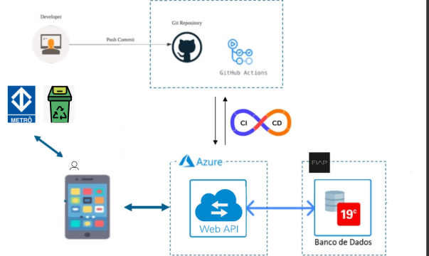

---

# 🌱 **SusEarth - Energia para um Futuro Sustentável**

### 💬 **Integrantes**
- **Ana Carolina Tavares** - RM552283  
- **Vinicius Minei** - RM98486  
- **Sofia Sprocatti** - RM99208  
- **Gabriel Lopes Pereira** - RM98023  

---

## 🌍 **Visão Geral do Projeto**

O **SusEarth** é um sistema inovador que busca promover a sustentabilidade por meio do descarte correto de resíduos eletrônicos em estações de metrô. A API conecta os usuários a pontos de coleta (PEVs - Pontos de Entrega Voluntária), ajudando a localizar estações próximas com coletores disponíveis e incentivando práticas ambientais conscientes.

Os objetivos principais do projeto são:
1. Facilitar o acesso à localização de PEVs em estações de metrô.
2. Promover a conscientização sobre o impacto positivo do descarte correto de resíduos eletrônicos.
3. Criar uma base tecnológica escalável para monitorar e otimizar o processo de descarte e coleta.

---
# Arquitetura SusEarth
<div style="display:flex;">
  
</div>


## 🔧 **Endpoints Disponíveis**

A seguir estão os endpoints implementados e suas funcionalidades:

### **User Controller**
Este controlador gerencia informações básicas sobre os usuários que interagem com o sistema.

- **`GET /api/User/{id}`**  
  Obtém os detalhes de um usuário específico pelo ID.  
  **Exemplo de resposta:**  
  ```json
  {
    "id": 1,
    "name": "João Silva",
    "email": "joao.silva@email.com"
  }
  ```

- **`POST /api/User`**  
  Adiciona um novo usuário ao sistema.  
  **Exemplo de corpo da requisição:**  
  ```json
  {
    "name": "João Silva",
    "email": "joao.silva@email.com"
  }
  ```

---

### **WasteInfo Controller**
Este controlador é o núcleo da API, fornecendo informações relacionadas aos PEVs nas estações de metrô.

- **`GET /api/WasteInfo/findNearestMetro/{cep}`**  
  Retorna a estação de metrô mais próxima de um endereço (identificado pelo CEP).  
  **Exemplo de resposta:**  
  ```json
  {
    "station": "Sé",
    "address": "Praça da Sé, São Paulo - SP",
    "distance": "1.2km"
  }
  ```

- **`GET /api/WasteInfo/find-cep/{cep}`**  
  Retorna informações detalhadas sobre PEVs disponíveis no CEP informado.  
  **Exemplo de resposta:**  
  ```json
  {
    "cep": "01001-000",
    "stations": [
      {
        "station": "Sé",
        "pevCapacity": "80%",
        "acceptedWaste": ["pilhas", "baterias", "celulares"]
      }
    ]
  }
  ```

- **`POST /api/WasteInfo`**  
  Permite adicionar informações de novos PEVs ao sistema.  
  **Exemplo de corpo da requisição:**  
  ```json
  {
    "station": "Luz",
    "pevCapacity": "100%",
    "acceptedWaste": ["pilhas", "baterias", "câmeras"]
  }
  ```

---

## 🛠 **Como Testar a API**

### 1. Clone o repositório
Baixe o projeto na sua máquina:
```bash
git clone https://github.com/anabrandt/susearth.git
```

### 2. Restaure as dependências
No terminal, navegue até o diretório do projeto e rode:
```bash
dotnet restore
```

### 3. Configure o banco de dados
Certifique-se de inserir os detalhes da conexão no arquivo **appsettings.json**.

### 4. Execute o servidor
Inicie o servidor com:
```bash
dotnet run
```

A API estará disponível no endereço `https://localhost:7187`.

---

## 📝 **Documentação da API**

Acesse a documentação interativa com o **Swagger**:  
[Swagger UI - SusEarth](https://localhost:7187/swagger/index.html)  

Nela, você pode testar os endpoints e explorar as funcionalidades diretamente no navegador.

---

## 📦 **Planejamento Futuro**

Embora a API atual seja funcional para busca e gestão de PEVs, o projeto tem potencial para incorporar as seguintes melhorias:
1. **Monitoramento em tempo real:**  
   Implementação de dispositivos IoT para acompanhar a ocupação dos PEVs.
2. **Notificações personalizadas:**  
   Alerta para usuários sobre PEVs próximos com capacidade disponível.
3. **Painel administrativo:**  
   Interface para que os gestores analisem dados sobre a ocupação e eficiência do projeto.
4. **Expansão geográfica:**  
   Escalabilidade para abranger mais locais além das estações de metrô de São Paulo.

---

## 📝 **Conclusão**

O **SusEarth** é um projeto que alia tecnologia e sustentabilidade para enfrentar os desafios do descarte de resíduos eletrônicos. Nossa API é um primeiro passo para conectar pessoas a soluções práticas e promover um futuro mais verde e consciente.